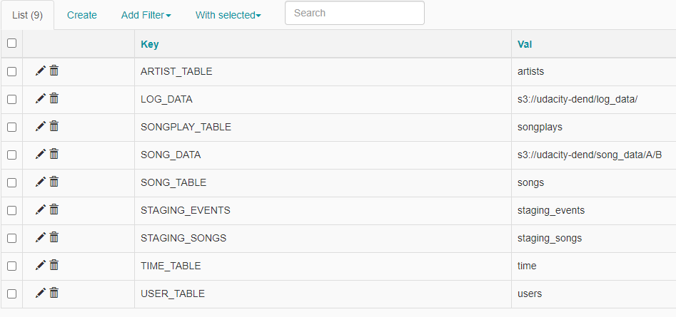

# Data Pipelines with AirFlow Project

The purpose of each file will be described in below, also the instruction on how to run the DAG and verify the result will be mentioned.  

## 1. variables.json

This contains list of runtime variables defined in Admin menu on Airflow Web server.

```
{
    "ARTIST_TABLE": "artists",
    "LOG_DATA": "s3://udacity-dend/log_data/",
    "SONGPLAY_TABLE": "songplays",
    "SONG_DATA": "s3://udacity-dend/song_data/A/B",
    "SONG_TABLE": "songs",
    "STAGING_EVENTS": "staging_events",
    "STAGING_SONGS": "staging_songs",
    "TIME_TABLE": "time",
    "USER_TABLE": "users"
}
```

In here, we store the table names, the S3 address of JSON files, the IAM role name using for Redshift in variables. Later on we will retrieve them when creating tasks.

## 2. /plugins/operators/stage_redshift.py

This is where StageToRedshiftOperator defined and we will use this operator to create tasks to loading JSON files locating at S3 to staging tables of Redshift.

First, we define some class variables which will be shared by all tasks created using StageToRedshiftOperator.

```
    ui_color = '#358140'
    
    template_fields = ["execution_date"]
    
    copy_sql = """
                    COPY {}
                    FROM '{}{}'
                    ACCESS_KEY_ID '{}'
                    SECRET_ACCESS_KEY '{}'
                    JSON 'auto ignorecase';
                """
```

* `ui_color`: is the color of task will be display on AirFlow web server.
* `template_fields`: consists of list of instance variables whose values will be taken from context.
* `copy_sql`: the template of COPY command which will load JSON files from S3 into staging table in Redshift. Since the table name, S3 address as well as IAM role will be varied so this template will allow us to build the SQL command flexibly.

Next, we define some instance variables whose values would be varied between tasks.

```
    @apply_defaults
    def __init__(self,
                 redshift_conn_id="",
                 aws_credential_id="",
                 table="",
                 s3_bucket="",
                 execution_date="",
                 *args, **kwargs):

        super(StageToRedshiftOperator, self).__init__(*args, **kwargs)
        self.table = table
        self.redshift_conn_id = redshift_conn_id
        self.aws_credential_id = aws_credential_id
        self.s3_bucket = s3_bucket
        self.execution_date=execution_date
```

* `table`: the destination table name.
* `redshift_conn_id`: the Redshift connection defined in Admin\Connections on Airflow web server.
* `s3_bucket`: the S3 address where JSON files located.
* `execution_date`: the logical date in format `YYYY-MM-DD` when the task executed.

Finally, we define logic for operator in `execute()` function. 

```
def execute(self, context):
        
        self.log.info('StageToRedshiftOperator is executing staging table {}'.format(self.table))
        
        aws_hook = AwsHook(self.aws_credential_id)
        
        credentials = aws_hook.get_credentials()
        
        redshift = PostgresHook(postgres_conn_id=self.redshift_conn_id) 

        self.log.info("StageToRedshiftOperator is clearing data from staging table {}".format(self.table))
        
        redshift.run("DELETE FROM {}".format(self.table))        
        
        formatted_sql = StageToRedshiftOperator.copy_sql.format(
                            self.table,
                            self.s3_bucket, 
                            self.execution_date,
                            credentials.access_key,
                            credentials.secret_key                          
                        )
        
        self.log.info("StageToRedshiftOperator is copying data from S3 to staging table {}".format(self.table))
        
        redshift.run(formatted_sql)
        
        self.log.info('StageToRedshiftOperator finishes staging table {}'.format(self.table))
```

Basically we will:
* Initializing the Redshift connection.
* Cleaning data of staging table before adding data.
* Formatting the class variable `copy_sql` by passing instance variables to build the COPY command.
* Run the COPY command to loading data from S3 to Redshift.

Before executing each steps, we will write a informational log, it will help us to verify how the task running easier.


## 3. /plugins/operators/load_fact.py

This is where LoadFactOperator defined and we will use this operator to create tasks to querying data from staging tables `STAGING_SONGS` and `STAGING_EVENTS`, then adding into fact `SONGPLAYS` table.

First, we define some class variables which will be shared by all tasks created using LoadFactOperator.

```
    ui_color = '#F98866'
    
    insert_sql = """
                INSERT INTO {}
                {}
                """
```

* `ui_color`: the color of task will be display on Airflow Web server.

* `insert_sql`: the template of INSERT command which will select data from staging table in Redshift. Depend on the certain case, we can pass the staging table name and SELECT query flexibly to build the INSERT command.

Then, we define some instance variables.

```
    @apply_defaults
    def __init__(self,
                 table="",
                 sql="",
                 redshift_conn_id="",
                 *args, **kwargs):

        super(LoadFactOperator, self).__init__(*args, **kwargs)
        self.table = table
        self.sql = sql
        self.redshift_conn_id=redshift_conn_id
```

* `table`: is the fact table name.
* `sql`: is the SELECT SQL to querying data from staging tables.
* `redshift_conn_id`: the Redshift connections defined in Admin\Connections on Airflow web server.

Finally, we define the logic for the operator in `execute()` function.

```
    def execute(self, context):
        
        self.log.info('LoadFactOperator is executing.')
        
        redshift = PostgresHook(postgres_conn_id=self.redshift_conn_id) 
        
        formatted_sql = LoadFactOperator.insert_sql.format(
                            self.table,
                            self.sql                            
                        )
        
        redshift.run(formatted_sql)
        
        self.log.info('LoadFactOperator finished.')
```

Following are steps will be perform whenever a task of LoadFactOperator run.

* Initalizing Redshift connection.
* Passing table name and SELECT SQL from instance variables to class variable `insert_sql` to build the INSERT command.
* Redshift run the INSERT command to SELECT data from staging table, then adding those data into fact table.
* Before executing each step, we write informational logs for investigation purpose.


## 4. /plugins/operators/load_dimension.py

This is where LoadDimensionOperator defined and we will use it to create tasks to querying data from staging tables, then adding them into dimension tables.

Similar to `load_fact.py` above, we also define some class variables as below. We have `truncate_sql` to clear existing data from table before adding new one.


```
    ui_color = '#80BD9E'
    
    truncate_sql = " TRUNCATE {};"
    
    insert_sql = """
                INSERT INTO {}
                {};
                """
```

Then, we define some instance variables.

* `table`: is dimension table name.
* `sql`: is the SELECT SQL command to querying data from staging table.
* `truncate`: which is True or False, its value will tell whether the table will be truncated before data added or not.

```
    @apply_defaults
    def __init__(self,
                 table="",
                 sql="",
                 redshift_conn_id="",
                 truncate=False,
                 *args, **kwargs):

        super(LoadDimensionOperator, self).__init__(*args, **kwargs)
        self.table = table
        self.sql = sql
        self.truncate = truncate
        self.redshift_conn_id=redshift_conn_id
```

Finally, we define logic for the operator.

```
def execute(self, context):
        
        self.log.info('LoadDimensionOperator is executing dimension table: {}'.format(self.table))
        
        redshift = PostgresHook(postgres_conn_id=self.redshift_conn_id)
        
        formatted_sql = LoadDimensionOperator.insert_sql.format(
                            self.table,
                            self.sql                            
                        )
        
        if self.truncate == True:
            formatted_sql = LoadDimensionOperator.truncate_sql.format(self.table) + formatted_sql
        
        redshift.run(formatted_sql)
        
        self.log.info('LoadDimensionOperator finish dimension table: {}'.format(self.table))
```

* First, we will initialize the Redshift connection using `PostgresHook`.
* Second, we build the INSERT command by passing dimension table name and SELECT SQL command into class variable `insert_sql`.
* If `self.truncate == True`, we will add TRUNCATE SQL in front of the INSERT command, then it will be executed first.
  Otherwise, we will not have TRUNCATE option.
* Eventually, Redshift will run the command.


## 5. /plugins/operators/data_quality.py

This is where DataQualityOperator defined and we will use it to create task which will run SQL command to find invalid records in both fact & dimension table. If any found, we will raise a ValueError and the task will be failed.


```
    ui_color = '#89DA59'
    
    sql_check = {
        'song': { "sql": " SELECT COUNT(1) FROM public.artists WHERE artistid IS NULL ", "expect_result": 0 },
        'artists': { "sql": " SELECT COUNT(1) FROM public.songs WHERE songid IS NULL ", "expect_result": 0 },
        'songplays': { "sql": """ SELECT COUNT(1) FROM public.songplays WHERE playid IS NULL 
                                                                      OR start_time IS NULL 
                                                                      OR userid IS NULL """, "expect_result": 0 },
        'time': { "sql": " SELECT COUNT(1) FROM public.time WHERE start_time IS NULL ", "expect_result": 0 },
        'users': { "sql": " SELECT COUNT(1) FROM public.users WHERE userid IS NULL ", "expect_result": 0 }
    }
```

Beside the color of task, for each table, we will define a query to counting the number of invalid records and corresponding expected result. We put all `expect_result` 0 since we expect no invalid record found for all of those table. If the output of the query 0, that mean the table has at least one invalid record. In that case, the data check process will be failed.


```
     @apply_defaults
    def __init__(self,
                 redshift_conn_id="",
                 *args, **kwargs):

        super(DataQualityOperator, self).__init__(*args, **kwargs)
        self.redshift_conn_id = redshift_conn_id
```

In `__init__` function, we simply define a instance variable `redshift_conn_id` for Redhsift connection.

And logic for `execute()` function is simple as well.

```
    def execute(self, context):
        
        self.log.info('Start validating data.')
        
        redshift = PostgresHook(postgres_conn_id=self.redshift_conn_id)
        
        for table, check in DataQualityOperator.sql_check.items():
            sql = check['sql']
            
            expect_result = check['expect_result']
            
            records = redshift.get_records(sql)[0]
        
            if records[0] != expect_result:
                self.log.info(f"Table {table} did not pass the test." )
                self.log.info(sql)
                raise ValueError("Data quality check failed")
        
        self.log.info('All tables have valid data.')
        
        self.log.info('Finished validating data.')
```

Firstly, we just initialize the Redshift connection.

Then we iterate over each item in the dictionary `sql_check`, we will run SELECT SQL command to count the invalid record, then compare the result to the `expect_result`. 

We will raise ValueError whenever any one of table has any invalid records found. In this case, the task will be failed. Otherwise, it will be completed successfully.

We also will write logs to monitoring task easier.


## 6. /dags/udac_example_dag.py

This is where we define the DAG with its tasks and their dependencies.

### 6.1. DAG

Before DAG creation, we define some configurations for DAG inside a dictionary named `default_args`.

```
default_args = {
    'owner': 'udacity',
    'start_date': datetime(2018, 11, 1),
    'end_date': datetime(2018, 11, 5),
    'email_on_retry': False,
    'depends_on_past': False,
    'retries': 3,
    'retry_delay': timedelta(minutes=5),
    'catchup': False,
    'redshift_conn_id': 'redshift',
    'aws_credential_id': 'aws_credentials'
}
```

* `start_date`: we put 1st Nov 2018 as start date then DAG will perform on that date's data.
* `end_date`: as sample we put 5th Nov 2018, then whenever data of that date read, DAG will not continue anymore. Without this, DAG will run for all the date whose data is available.
* `email_on_retry: False`: Airflow will not send notification emails when retrying run the tasks.
* `depends_on_past: False`: the DAG does not have dependencies on past runs.
* `retries: 3`: the tasks will retry to run up to 3 times whenever failed.
* `retry_delay: timedelta(minutes=5)`: the retry will be run every 5 minnutes.
* `catchup: False`: turn off the catchup.
* `redshift_conn_id: 'redshift'`: take the `redshift` connection which predefined in Admin\Connections menu of Airflow web server.
* `aws_credential_id: 'aws_credentials'`: take the `aws_credentials` connection which predefined in Admin\Connections menu of Airflow web server.

Then, we define a DAG named `udac_dag` with some configurations defined in `default_args`.

```
dag = DAG('udac_dag',
          default_args = default_args,
          description = 'Load and transform data in Redshift with Airflow',
          schedule_interval = '@hourly',
          max_active_runs = 3
        )
```

With `schedule_interval='@hourly'`, DAG will run in every 1 hour until reaches the `end_date` defined in `default_args`. We can measure this in Tree View tab when DAG running.

`max_active_runs = 3` will tell Airflow that maximum only 3 run working in same time. 

### 6.2. Tasks

#### 6.2.1. START & END tasks

There are 2 tasks `start_operator` and `end_operator` created from `DummyOperator` operator.

#### 6.2.2. LOADING DATA TO STAGING TABLES tasks

We have 2 tasks here:

**`stage_events_to_redshift`**: will loading **LOG** data to staging table named `Stage_events`.

```
stage_events_to_redshift = StageToRedshiftOperator(
    task_id='Stage_events',
    dag=dag,
    table = Variable.get("STAGING_EVENTS"),
    s3_bucket = Variable.get("LOG_DATA"),
    execution_date = '{{execution_date.year}}/{{execution_date.month}}/{{ds}}-events.json'
)
```

In here, we passed values into the operator's variables:
* Table name is `staging_events`.
* Values of `table` and `s3_bucket` should be taken from corresponding runtime variables `STAGING_EVENTS` and `LOG_DATA` defined on Airflow web server.
* Value of execution date will come from default variables `{{ ds }}` of Airflow.
* We don't need to specify the values for `redshift_conn_id` and `aws_credential_id` here since they already have been defined in `default_args` in DAG level and they are shared with all tasks.


**`stage_songs_to_redshift`**: will loading **SONG** data to staging table named `Stage_songs`.

```
stage_songs_to_redshift = StageToRedshiftOperator(
    task_id = 'Stage_songs',
    dag = dag,
    table = Variable.get("STAGING_SONGS"),
    s3_bucket = Variable.get("SONG_DATA"),
)
```

In here, we passed values into the operator's variables:
* Table name is `Stage_songs`.
* Values of `table` and `s3_bucket` should be taken from corresponding runtime variables `STAGING_SONGS` and `SONG_DATA` defined on Airflow web server.

#### 6.2.3. LOADING DATA INTO FACT TABLE task

There is only one task named `load_songplays_table` to loading data into a fact table named **SONGPLAYS**

```
load_songplays_table = LoadFactOperator(
    task_id = 'Load_songplays_fact_table',
    dag = dag,
    table = Variable.get("SONGPLAY_TABLE"),
    sql = SqlQueries.songplay_table_insert
)
```

In order to create task, we passed values into operator's parameters:
* The table name `SONGPLAYS` defined as value of a runtime variable named `SONGPLAY_TABLE`.
* The corresponding SQL comes from predefined `SqlQueries` module.

#### 6.2.4. LOADING DATA INTO DIMENSION TABLE tasks

There are 4 tasks created to load data into 4 dimension tables: `users, artists, songs, time`.

```
load_user_dimension_table = LoadDimensionOperator(
    task_id = 'Load_user_dim_table',
    dag = dag,
    table = Variable.get("USER_TABLE"),
    sql = SqlQueries.user_table_insert,
    truncate = True
)

load_song_dimension_table = LoadDimensionOperator(
    task_id = 'Load_song_dim_table',
    dag = dag,
    table = Variable.get("SONG_TABLE"),
    sql = SqlQueries.song_table_insert,
    truncate = True
)

load_artist_dimension_table = LoadDimensionOperator(
    task_id = 'Load_artist_dim_table',
    dag = dag,
    table = Variable.get("ARTIST_TABLE"),
    sql = SqlQueries.artist_table_insert,
    truncate = True
)

load_time_dimension_table = LoadDimensionOperator(
   task_id = 'Load_time_dim_table',
   dag = dag,
   table = Variable.get("TIME_TABLE"),
   sql = SqlQueries.time_table_insert,
   truncate = True
)
```

We are using a operator named `LoadDimensionOperator` to define those tasks, so only `table` and `sql` parameters are different between them.

* the values of `table` parameter are retrieved from runtime variables defined in Airflow.
* similar to fact table,  the INSERT SQL comes from predefined `SqlQueries` module.

#### 6.2.5. DATA CHECK task

There is only one `run_quality_checks` task to validate data of both fact & dimension tables.

```
run_quality_checks = DataQualityOperator(
    task_id = 'Run_data_quality_checks',
    dag = dag,
)
```

### 6.3. Task dependencies.

```
start_operator >> (stage_events_to_redshift, stage_songs_to_redshift)  >> load_songplays_table

load_songplays_table >> (load_user_dimension_table, load_song_dimension_table, load_artist_dimension_table, load_time_dimension_table) >> run_quality_checks >> end_operator
```

With the dependencies defined above, we will have a flow like the image below.


## 7. How to run.

First, create a Redshift cluster and run SQL from `create_tables.sql` to create tables.

Second, we will create `aws_credentials` and `redshift` connections in Admin\Connections menu on Airflow web server.

 


Third, upload runtime variables defined in `variables.json` in Admin\Variables menu.


then we will have a list of variables imported like the image below.



After that we could start Airflow web server and turn on the DAG to see how it runs.